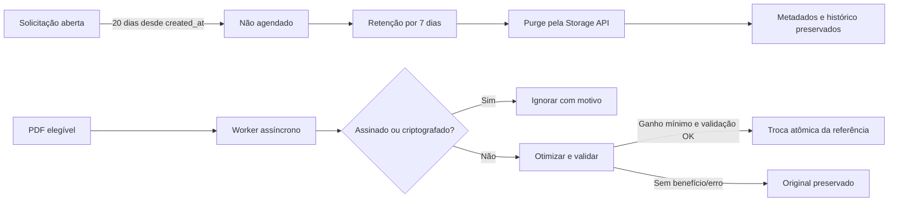

# Flow Contract — Portal Guardian

## Cabeçalho

- Módulos afetados: Agendamentos, RH/Currículos, Mídias, Storage e Auditoria.
- Atores: sistema (`actor_kind=system`), equipe com `settings.manage` (leitura) e Superadministrador (configuração).
- Evento inicial: job diário ou execução manual em modo simulação.
- Objetivo: encerrar solicitações abertas há 20 dias, reter anexos por 7 dias, monitorar referências e otimizar PDFs com segurança.
- Resultado: `APPROVED WITH CONDITIONS`.

## Fontes de verdade

- Nascimento da solicitação: `appointment_requests.created_at`.
- Finalização: `appointment_requests.completed_at`.
- Estado final compatível: `workflow_status=NAO_AGENDAVEL`, `status=CANCELLED`.
- Referências físicas: `storage_path` e `preview_storage_path`; exclusão somente pela Storage API.
- Currículo atual: `candidate_resumes.storage_path` e `size_bytes`.

## Matriz de transições

| Origem             | Evento                     | Destino                     | Quem    | Auditoria                                        |
| ------------------ | -------------------------- | --------------------------- | ------- | ------------------------------------------------ |
| estado aberto      | 20 dias completos          | `NAO_AGENDAVEL`/`CANCELLED` | Sistema | `AUTO_CLOSED_BY_SYSTEM_TIMEOUT`, `actor_id=null` |
| finalizado         | `completed_at + 7 dias`    | anexos purgados             | Sistema | job + status por documento                       |
| PDF elegível       | claim exclusivo            | processando                 | Sistema | execução do job                                  |
| PDF validado       | troca compare-and-set      | otimizado                   | Sistema | tamanhos/hash sem conteúdo                       |
| órfão novo         | primeira detecção          | suspeito                    | Sistema | finding                                          |
| órfão reincidente  | período de observação      | confirmado                  | Sistema | finding, sem exclusão imediata                   |
| referência ausente | verificação de integridade | indisponível, sem purge     | Sistema | finding + status de integridade                  |

## Simplificações, impacto e guardas

- Reutilizar o estado final atual; não criar status visual redundante.
- Triggers calculam a retenção; workers executam efeitos externos.
- Jobs são idempotentes, em lotes, com claims exclusivos e tentativas limitadas.
- Nenhuma rota aceita caminho de Storage fornecido pelo navegador.
- Configurações destrutivas nascem desligadas; ativação exige Superadministrador.
- Migração apenas classifica e preenche datas: não apaga arquivos nem fecha solicitações.
- PDFs assinados/criptografados e arquivos pequenos não são alterados.
- A otimização não roda no runtime Edge; usa worker Node compatível.
- Usuário vê encerramento automático e indisponibilidade correta após purge.
- Arquivo ausente antes do Guardian é marcado como indisponível; a equipe recebe orientação de reenvio e as ações de visualizar/baixar/conferir são ocultadas.
- Manifests, marcadores de expiração, uploads pendentes e rate-limit pertencem ao plano de controle e não são órfãos.
- Operação vê faixas 15–16, 17–19 e 20+ dias; falhas não bloqueiam atendimento.

## Condições para implementação

1. Produção não pode ser ativada antes de dry run revisado.
2. Auto fechamento, purge, otimização e limpeza de órfãos iniciam `false`.
3. Nenhuma exclusão direta em `storage.objects` e nenhum registro operacional é removido.
4. Alertas não criam aprovação manual obrigatória para o job.
5. Lint, tipos, testes, build e revisão de segurança precisam passar sem achados altos.
6. Produção pode receber migração, monitoramento e classificação com as chaves destrutivas desligadas; o scanner não remove arquivos.
